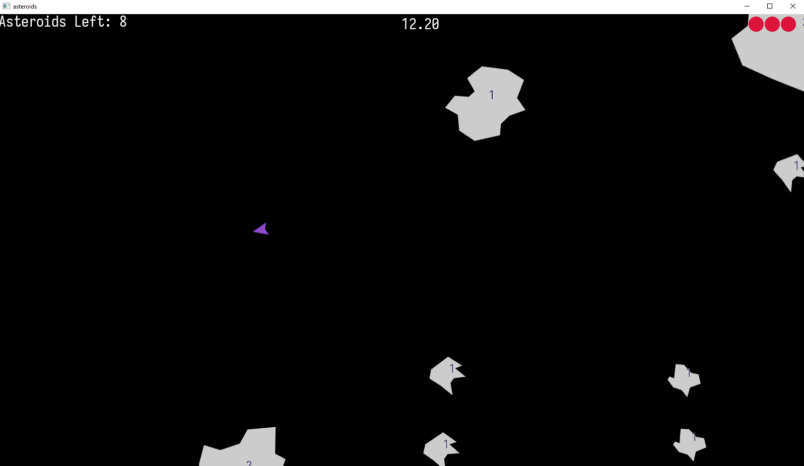
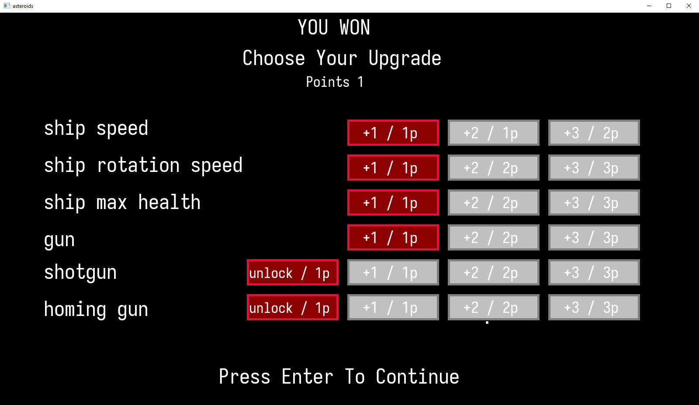

# About

This is my side project for my version of 'Asteroids' game.
The goal was to practice and implement SAT algorithm for collision detection, and
play around with more complex game logic.
Game should run on Windows and Linux.
You can build from source, or download released binary

# Build

Dependencies: SDL2, GLAD, GLM, Freetype2
- run the following scripts to build the project.
- 'BuildType' is either 'release' or 'debug'

### Windows
- project is setup and tested for MSVC compiler and Visual Studio
- dependencies are provided in external folder
- .\configure.bat -> .\build.bat --BuildType -> run executable in build folder 
- to install: .\install.bat and run from bin folder

### Linux
- project is setup and tested for GCC compiler
- make sure that SDL2 development package is installed on your distribution
- ./configure.sh -> ./build.sh --BuildType -> run executable in build directory
- to install: ./install.sh and run from bin directory

# ScreenShots

